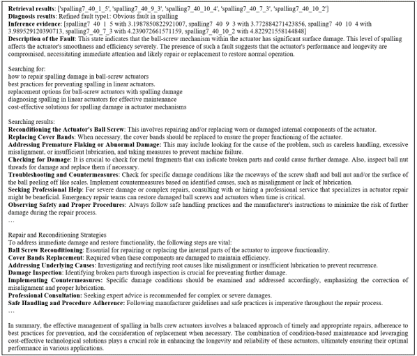

# ROCKET-RAG

## Introduction

This is the code for the paper "From Prediction to Prescription: Large Language Model Agent for Context-Awareness Maintenance Decision Support". Apply the Retrieval-Augemented Generation (RAG) model to the time series dataset. The framework can be used to combine the text and the time series to generate the docuementation based on contextual information.

Predictive analytics with machine learning approaches has widely penetrated and shown great success in system health management over the decade. However, how to convert the prediction to an actionable plan for maintenance is still far from mature. This study investigates how to narrow the gap between predictive outcomes and prescriptive descriptions for system maintenance using an agentic approach based on the large language model (LLM). Additionally, with the retrieval-augmented generation (RAG) technique and tool usage capability, the LLM can be context-awareness when making decisions in maintenance strategies proposal considering predictions from machine learning. In this way, the proposed method can push forward the boundary of current machine-learning methods from a predictor to an advisor for decision-making workload offload. For verification, a case study on linear actuator fault diagnosis is conducted with the GPT-4 model. The result demonstrates that the proposed method can perform fault detection without extra training or fine-tuning with comparable performance to baseline methods and deliver more informatic diagnosis analysis and suggestions. This research can shed light on the application of large language models in the construction of versatile and flexible artificial intelligence agents for maintenance tasks.

## System Framework
![[assets/diagram_of_agent.png]]

The ROCKET (Romdom Convolution Kernal Encoder) model is used to extract the time series features, and the top-k similar retrieved results are used to obtain the label of the state of the given signal. The GPT model can combine the text with the prediction to generate the docuementation based on contextual information for some downstream tasks such as decision support for assest maintenance.

## Results
RAG vs. InceptionTime
![[assets/retrieve_results.png]]

An example of the generated text with the fault $spalling 7$ (A full documentation can be found at the directory `logs`)
{width=100%}

## Usage

### Install the required packages

```shell
conda create -n rocket-rag python=3.11
conda activate rocket-rag
pip install -r requirements.txt
```

### Configurate the configs file

Create the `config/configs.json` file for setting up the api key and prarameters.
```json
{
    "google_api_key": "<YOUR GOOGLE API KEY>",
    "google_cse_id": "<YOUR GOOGLE CUSTOM SEARCH ENGINE>",
    "openai_api_key": "<YOUR OPENAI API KEY>",
    "gpt_model": "<GPT MODEL CARD>",
    "cur_smooth_ws": 15,
    "pos_smooth_ws": 20,
    "query_mode": ["knn", "ridge"]
}
```

### Preprocess the dataset

```shell
cd rocket-rag
python data_processing.py
```

### Run the agent

```shell
python agent.py
```

### Get the result
The reuslt will be stored at the `logs` directory after the agent is run.

## TODO List
- [ ] Add PDF parser for textual information retrieval and generation
- [ ] Add more retrieval methods and techniques, e.g., keyword sparse search, reranking
- [ ] Integrate more RAG modes such as Self-RAG, Corrective-RAG and Graph-RAG e.g.
- [ ] Reimplement the ROCKET and its variance from scratch
- [ ] Reimplement the RAG based on DSpy for lighter prompting engineering and management
- [ ] Reimplement the system in a more agentic way with better reasoning and planning 
- [ ] Support more opensource llm models e.g., llama3, chatGLM and so on
- [ ] Support the interactive mode for the agent to interact with the user by chatting like GPT
- [ ] Support the long-term memory for the agent to remember the previous conversation history
